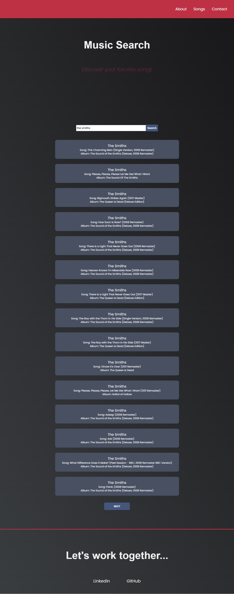

<ul>
<li>The "Music Search" project uses Deezer api to return the top songs searched by the user. Just enter the name of the artist or name of the song in the search field for the return of top 15 songs.
<li>Through the development mode, the project can be accessed by running npm start or yarn start in the project's root directory, the node must be installed with npm install.
<li>The project was developed by the Windows 10 operating system with 64 bits, Intel Core i5 processor, visual studio code editor, Chrome browser version 87.0.4280.66.
<li>The technologies used were react with hooks, typescript and scss. Media queries were used to make the page responsive.
<li>A preview of the page follows: 
 https://music-search-e6dbb.web.app/
<ul>
  

